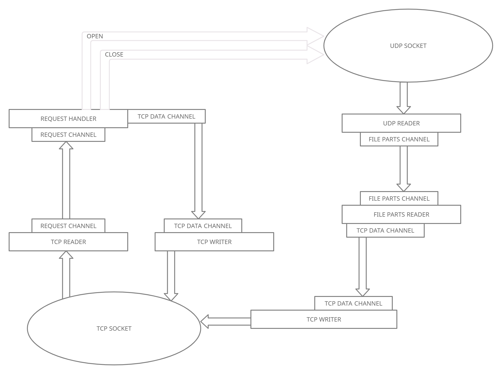

# GO implementation of [this](https://habr.com/ru/post/685870/) test task

## Annotation

Initially, this task implied a C++ implementation so there were some strict platform requirements.
I wanted to try to solve this task in GO (my primary language) and make it platform independent, so I get rid of such things.
Thus, there are no any syscalls or using WinAPI in my implementation that makes my solution
platform independent, but at the same time task becomes much easier.
Furthermore, GO provides high-level interface for working with network, so the initial
idea of this task to check deep understanding of low-level OS network primitives is completely lost.
Nevertheless, it was rather interesting to use _**net**_ package and solve some concurrency problems.
In the end, I got a self implemented likeness of file transfer protocol that was successfully deployed on my own
server (alsiberij.com:6969) on Ubuntu 22.04.
I strongly recommend every junior backend engineer to try to solve it on theirs own.

So, my task changes are:

- Implemented in GO
- Platform independence
- Program arguments enhancements
- Server always listening to 0.0.0.0
- File is not stored in memory in order to allow transferring big files
- Retry delay
- Added client download mode, so we are able to both upload and download files (by simple TCP transfer)
- Graceful shutdown

## Task
Develop two console applications (client.exe and server.exe) that are able to transfer files
by UDP with confirmations by TCP.

#### Server 
Server starts with three arguments: IP, TCP port and directory for saving files and listens to specified port.
Example: server 127.0.0.1:5555 temp

When corresponded requests is received, server starts to listen to specified UDP socket and waiting for file transferring. After receiving every file part 
server sends to client an acknowledgement. Packets are stored in memory until EOF signal. After that, server saves file in selected directory

#### Client
Client starts with 5 arguments: IP, TCP port, UDP port, filename, UDP timeout
Example: client 127.0.0.1 5555 6000 test.txt 500

When connection is established, client sends UDP port and filename to server. Then client starts to transfer file by blocks (every block has its own id)
by UDP datagrams and receiving TCP confirmations.

If confirmation was not received in time, this packet is transferring again. When the file has been transferred, client notifies server and closes tcp connection.

## Program arguments

- Client
- - `-file` Filename, required
- - `-mode` Specifies the client action: upload or download file (upload/download), required
- - `-addr` Remote address and port of server (domain names are allowed), required 
- - `-transfer-port` Port number that wll be user to transfer file (UDP), required in case of uploading file. Should be 1024-65535
- - `-log` **[1]** Log types. No logs - 0, progress logs - 1, progress and network logs - 2 
- - `-block` **[1461]** UDP block size. Should be 1-65496 (bytes)
- - `-retry-times` **[5]** Times to perform a retry in case of failed transfer. Should be 1-10
- - `-retry-delay` **[250]** Delay before next retry. Should be 0-1000 (ms)
- - `-timeout` **[500]** Timeout of confirmation file part. Should be 1-60000 (ms)

- Server
- - `-port` Port to listen, required
- - `-dir` **[.]** Directory for saving files
- - `-log` **[1]** Log types. No logs - 0, serving logs - 1, serving and network logs - 2

## Protocol description

### TCP messages format

Every is TCP message should have the following format [ **OPERATION** ][ **SIZE** ][ **CONTENT** ].

- **OPERATION** is a single byte that contains information about request/response.
- **SIZE** Two bytes that contain information about **CONTENT** size. Consider it as uint16 number.
- **CONTENT** Payload.

#### Requests

| Operation  | Size | Content example         | Description                               |
|------------|------|-------------------------|-------------------------------------------|
| 0x1F       | 2    | {port bytes}            | Sending UDP socket (uint16)               |
| 0x2F       | N    | test.txt                | Sending filename for uploading (raw text) |
| 0x3F (UDP) | 8+N  | {id bytes} {file bytes} | Sending file part (uint64 and content)    |
| 0x4F       | 0    |                         | Send EOF                                  |
| 0x5F       | N    | test.txt                | Send filename for downloading (raw text)  |

#### Responses

| Operation | Size | Content example     | Description                                                                          |
|-----------|------|---------------------|--------------------------------------------------------------------------------------|
| 0x1A      | 1    | 0xFF                | UDP socket opening (0xFF if ok, something else otherwise)                            |
| 0x2A      | 1    | 0xFF                | Creating file (0xFF if ok, something else otherwise)                                 |
| 0x3A      | 8+1  | {id bytes} [0xFF]   | Saving file part (id and 0xFF if ok, id and something else otherwise)                |
| 0x4A      | 1    | 0xFF                | Saving file (0xFF if ok, something else otherwise)                                   |
| 0x5A      | 1/N  | 0xFF / {file bytes} | Sending file (0xFF if file exists and transfer will start, something else otherwise) |

### Interacting example (upload)

- Opening socket 

- - Client requests opening 7070 UDP by sending [ **0x1F** ][ **0x2** ][ **0x1B** ][ **0x9E** ]
- - Server tries to listen to selected socket and respond with [ **0x1A** ][ **0x1** ][ **0xFF** ]

- Creating file

- - Client requests creating file 1.txt by sending [ **0x2F** ][ **0x5** ][ **0x31** ][ **0x2E** ][ **0x74** ][ **0x78** ][ **0x74** ]
- - Server tries to create file 1.txt and responds with [ **0x1A** ][ **0x1** ][ **0xFF** ] :

- Sending file parts

- - Client start sending file part (part id #0 contains two characters 'HL' ) via UDP socket [ **0x3F** ][ **0x9** ][ **0x0** ][ **0x0** ][ **0x0** ][ **0x0** ][ **0x0** ][ **0x0** ][ **0x0** ][ **0x0** ][ **0x48** ][ **0x4C** ]
- - Server tries to save this part and responds with [ **0x3A** ][ **0x9** ][ **0x0** ][ **0x0** ][ **0x0** ][ **0x0** ][ **0x0** ][ **0x0** ][ **0x0** ][ **0x0** ][ **0xFF** ]

- End of file

- - Client notifies server about EOF by sending [ **0x4F** ][ **0x0** ]
- - Server closes file and responds with [ **0x4A** ][ **0x1** ][ **0xFF** ]

_Check out source code if you want to know how does download mode work!_

## Finally, server schema... 

### Short description

When listener accepts a connection, it starts 3 goroutines - 

- **TCP reader**
- **Request handler**
- **TCP writer**

**TCP reader** reads stream of data, converts it to a request struct and writes it to **request chanel**.
At the same time **request handler** is blocked by waiting for data from **request channel**. When request is received it will be
processed and response will be written to **tcp data channel**, which is listened by **tcp writer**.
In case of closing tcp connection every goroutine will close its channel, so next goroutine have to close it's own. We have some kind of dominoes falling.
In the end every goroutine and channel will be closed.

